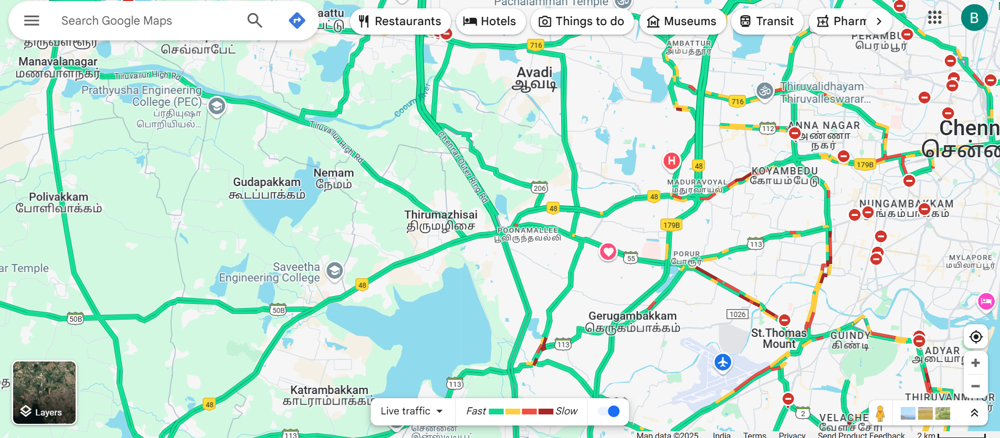

# EX01 Developing a Simple Webserver
## Date:19/09/2015

## AIM:
To develop a simple webserver to serve html pages and display the list of protocols in TCP/IP Protocol Suite.

## DESIGN STEPS:
### Step 1: 
HTML content creation.

### Step 2:
Design of webserver workflow.

### Step 3:
Implementation using Python code.

### Step 4:
Import the necessary modules.

### Step 5:
Define a custom request handler.

### Step 6:
Start an HTTP server on a specific port.

### Step 7:
Run the Python script to serve web pages.

### Step 8:
Serve the HTML pages.

### Step 9:
Start the server script and check for errors.

### Step 10:
Open a browser and navigate to http://127.0.0.1:8000 (or the assigned port).

## PROGRAM:

```
from django.shortcuts import render
from http.server import HTTPServer,BaseHTTPRequestHandler
content='''
<!DOCTYPE html>
<html lang="en">
<head>
<meta charset="UTF-8">
<meta name="viewport" content="width=device-width, initial-scale=1.0">
<title>Specification</title>
<style>
body{
background-color: #ecffc4fe;
}
table {
width: 30%;
margin: 20px auto;
border-collapse: collapse;
}
th, td {
padding: 8px;
border: 1px solid #000;
text-align: left;
}

h2{
text-align: center;
}
</style>
</head>
<body>
<h2>Laptop Specifications</h2>
<table class="specifications-table">
<tr>
<th>Specification</th>
<th>Details</th>
</tr>
<tr>
<td>Brand</td>
<td>HP</td>
</tr>
<tr>
<td>Model</td>
<td>HP Pavilion</td>
</tr>
<tr>
<td>Processor</td>
<td>Intel Core i5 11th Gen</td>
</tr>
<tr>
<td>RAM</td>
<td>8 GB</td>
</tr>
<tr>
<td>Storage</td>
<td>512 GB</td>
</tr>
<tr>
<td>Graphics</td>
<td>Integrated</td>
</tr>
<tr>
<td>Display</td>
<td>15.6 Inches</td>
</tr>
<tr>
<td>Battery Life</td>
<td>Up to 10 hours</td>
</tr>
<tr>
<td>Operating System</td>
<td>Windows 11</td>
</tr>
<tr>
<td>Special Feature</td>
<td>Anti Glare Screen</td>
</tr>
</table>
</body>
</html>'''

from http.server import HTTPServer,BaseHTTPRequestHandler
content ='''<html
><h1>Hello</h1>
</html>'''
class MyServer(BaseHTTPRequestHandler):
    def do_GET(self):
        print("Get request received...")
        self.send_response(200)
        self.send_header("content-type", "text/html")
        self.end_headers()
        self.wfile.write(content.encode())
print("This is my webserver")
server_address =('',8000)
httpd = HTTPServer(server_address,MyServer)
httpd.serve_forever()

```


## OUTPUT:



## RESULT:
The program for implementing simple webserver is executed successfully.

